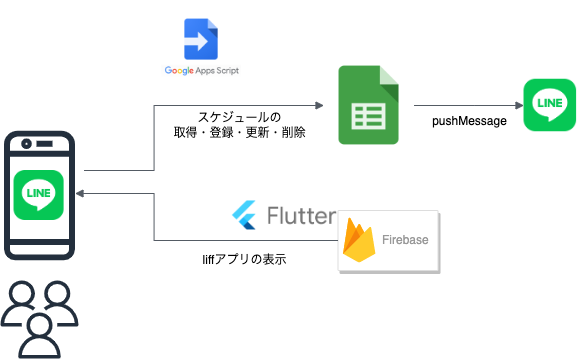

# flutter_liff_scheduler

Flutter webとliffを組み合わせてスケジュール共有アプリを作るサンプルプロジェクト



## 開発環境
```
% fvm flutter --version
Flutter 3.3.1 • channel stable • https://github.com/flutter/flutter.git
Framework • revision 4f9d92fbbd (2 weeks ago) • 2022-09-06 17:54:53 -0700
Engine • revision 3efdf03e73
Tools • Dart 2.18.0 • DevTools 2.15.0
```

## ローカル環境での実行方法
- fvmでflutterのバージョンをあわせる
```bash
fvm install

# fvmが未インストールなら先に以下を実行
pub global activate fvm
export PATH="$PATH":"$HOME/.pub-cache/bin"
```

- デバッグ実行
```
flutter run -d web-server --web-port 8080
```

- ngrokでの一時公開(flutter runしているターミナルとは別ターミナルで実施)
```bash
ngrok http 8080

# ngrokをインストールしていない場合は以下を実施
## ngrokをインストール
brew install ngrok
## 以下のURLにアクセスしSignUp後 Your AuthtokenからTokenをコピー
https://dashboard.ngrok.com/
## 控えたTokenを入れて認証
ngrok config add-authtoken <Your Authtoken>
```

- ngrokを起動したターミナルで表示されている`Forwarding`の`https://<ランダム値>.ngrok.io`のURLをLINE Developersコンソールから対象のLiffが紐付いているLINEログインチャネルのコールバックURLに指定する。
- 上記の設定でngrokが払い出したURL経由でLINEログインが許可される様になる。